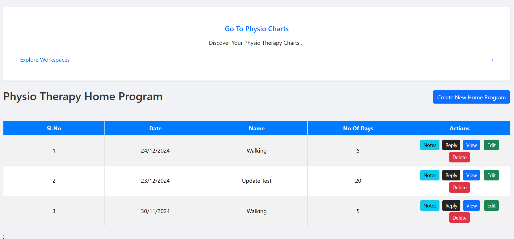
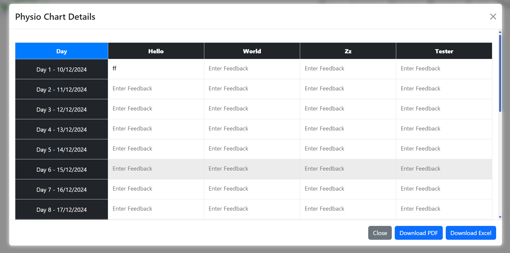
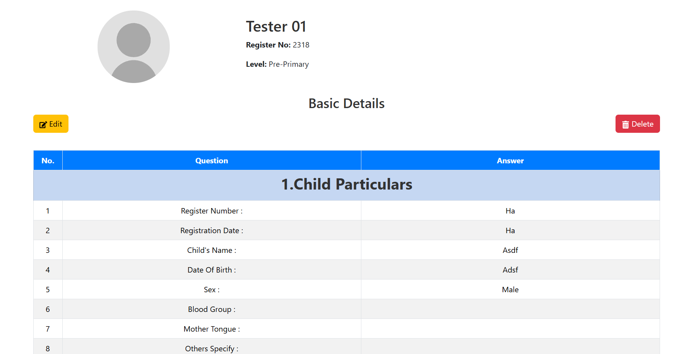

# 📘 Special School DataHub

**Location:** Tamil Nadu, India  
**Email:** [official.ms.baskaran@gmail.com](mailto:official.ms.baskaran@gmail.com)

---

## 🔗 Project Links

- 🚀 **Live Demo**: [Click here to view](https://datahub-demo-ms.vercel.app/)
- 💻 **Frontend Repository**: [GitHub - Frontend](https://github.com/BaskaranMS/datahub_demo_frontend)
- 🛠️ **Backend Repository**: [GitHub - Backend](https://github.com/BaskaranMS/datahub_demo_backend)

---

## 🔐 Demo Login Credentials

> Use the following credentials to log in and explore the platform.

### 👑 Admin Login

- **Username:** admin
- **Password:** adminadmin123

### 🧑‍🏫 Staff Login

- **Username:** 001
- **Password:** helloworld

### 🧑‍🎓 Student/Parent Login

- **Username:** 001
- **Password:** helloworld

---

## 🎯 Purpose

The **Special School DataHub** is a centralized digital platform designed specifically for special education institutions. It enables seamless management of students, staff, assessments, resources, and communication between admins, staff, parents, and super admin.

---

## 🛠 Key Features

### 🛡️ Admin Features

- **Dashboard with Analytics**

  - Student assessments per category
  - Staff performance metrics
  - Overall school progress and trends

- **Assessment Management**

  - Create, edit, delete assessment questions for:
    - Physio
    - Vocational
    - Primary
    - Secondary
    - Speech Language Profile
    - Template Case Record
    - Basic Details

- **Student Management**

  - View full student profiles
  - Access historical data and assessments
  - Manage student leave requests
  - Upload profile photo

- **Staff Management**

  - Create/edit/delete staff records
  - Assign students to staff
  - Manage access permissions
  - Enter personal details
  - Manage staff leave
  - Upload staff profile photo

- **Resource & Material Management**

  - View/manage teaching materials
  - Handle new material requests
  - Manage meetings and schedules

- **Communication & Notifications**

  - Create announcements
  - Receive messages from parents
  - Send notifications to parents
  - Track parent-related activities

- **Specialized Workspaces**

  - Physiotherapy
  - Occupational Therapy

- **Activity Tracking**
  - Track staff and admin activities

---

### 🧑‍🏫 Staff Features

- **Dashboard**

  - View personal performance and work summaries

- **Assessments**

  - Conduct and submit assessments across all categories

- **Work Summary**

  - View completed/pending tasks

- **Leave Management**

  - Submit leave requests

- **Messaging**

  - Message students and their parents

- **Access Control**
  - Access only permitted features based on admin permissions

---

### 👨‍👩‍👦 Parent Features

- **Student Performance Tracking**

  - View detailed performance and assessment data

- **Staff Reviews**

  - Read reviews and feedback from staff

- **Notifications**

  - Receive system-generated alerts and announcements

- **Messaging**
  - Send messages to admin/staff

---

### 👑 Super Admin Features

- **Student Master Data**

  - Manage comprehensive student data from past to present

- **Donations Management**

  - Record donations
  - Print receipts (2 copies per page, PDF format)

- **Fee Management**

  - Manage fees and concessions
  - Print receipts (2 copies per page, PDF format)

- **Admission Management**

  - Create new admissions
  - Generate and share parent form links
  - Finalize admission with admin office follow-up

- **Notification Management**
  - Platform-wide notifications and announcements

---

## ☁️ Cloud Storage

- **AWS S3** used for secure image uploads for student and staff profiles.

---

## 💻 Technology Stack

### Frontend

- ⚛️ React.js
- 💅 Tailwind CSS
- 📈 Chart.js

### Backend

- 🚀 Node.js
- 🛠️ Express.js

### Database

- 🗃️ MongoDB

### Authentication & Communication

- 🔐 JWT (JSON Web Tokens)
- 📧 Nodemailer

### Cloud Storage

- ☁️ AWS S3

---

## 📈 Business Benefits

- **Centralized Communication**

  - Unified portal for parents, staff, and admins

- **Improved Outcomes**

  - Data-driven decision-making for student development

- **Efficient Resource & Leave Management**

  - Track materials, staff/student leaves, and requests

- **Secure Cloud Storage**

  - Use of AWS S3 for image management

- **Scalable System**
  - Expandable to accommodate new features, users, and data

---

## 👥 Project Collaborators

- **Baskaran M S** – Developer
- **Mohamed Ashif** – Developer

---

## 🖼️ Snapshots

---

## 📍 Conclusion

The **Special School DataHub** provides a robust solution for managing the unique needs of special education schools. By centralizing student performance data, resource management, and communication, it empowers schools to deliver better educational and therapeutic outcomes.

For more information or to discuss custom implementations, please contact us.
